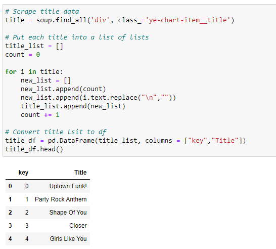
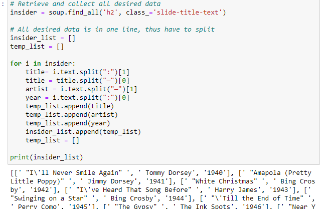
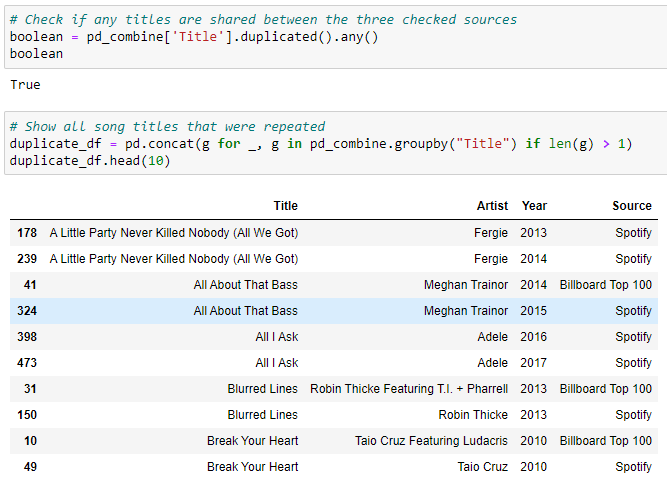

# ETL-Project

Working closely with a team through all phases of the project to ensure that there are no surprises; Imagine a bunch of data came in and you and your team are tasked with migrating it to a production data base.
  
Using three sources: One CSV file from Kaggle and two intenet sources (Billboard top 100 and Insider), We Extracted, Transformed and Loaded the data into different collections to be further analysed later.

## Extract: your original data sources (CSV and  JSON).
Sample read in csv format. Also read from live web pages.

## Transform: data cleaning and transformations 
### Billboard loop
Use three a for loops to pull out Title, Artist and Year then perform a merge 

### Insider loop
Use a for loop to slpit one line from an internet souces to get desired data

## Load: the final database, tables/collections.
Used pandas to merge the data  
Using SQL/ pgAdmin resulted inn a dropped row when performing unions 
Followed up by verrify all data was transferred properly

## Analyse
Put all repeated titles in a dataframe to see which songs were popular on multiple sorces and years

For more indepth understanding of what was done and the challenges we faced  
Please see the word file titled ETL Project.docx
